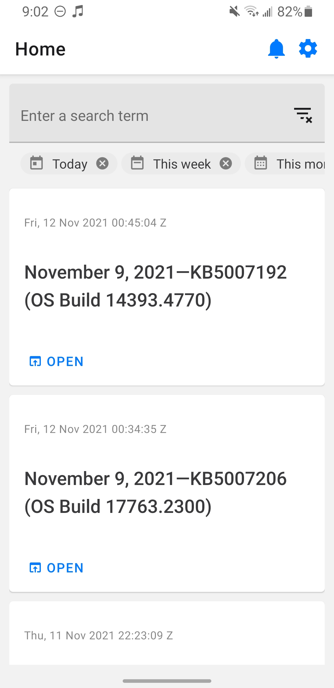
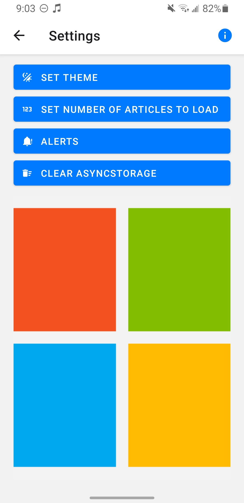
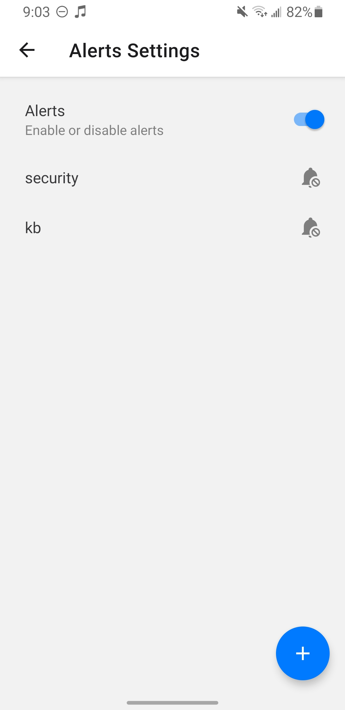
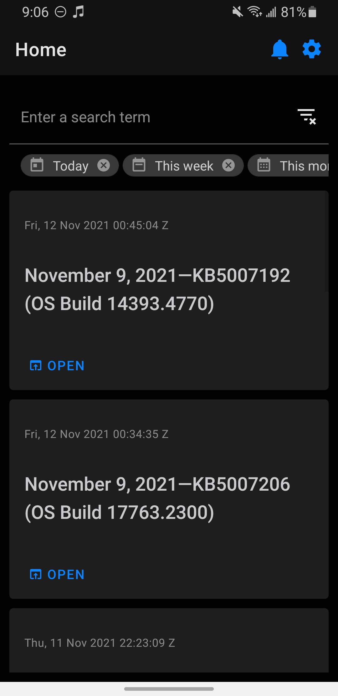

# Microsoft KB Article Viewer

## What
A feed of every KB article Microsoft has ever published, with filtering and search.

### Features
 - Material Design
 - Dark mode
 - User-configurable alerts
 - Easy to use filtering and search

## Why
Quickly access nearly every KB article about Windows Microsoft has ever published in a lightweight app, with search, alerts, and advanced filtering features. Featuring a beautiful, Material Design UI, Microsoft KB Viewer is designed to be lightweight and speedy while not compromising on functionality. Honestly, the app is more of an excersise than an actual product. Any sane person should just use [Microsoft's support website](https://support.microsoft.com/).

## Technologies Used
 - [Expo 41](https://docs.expo.dev/)
 - [React Navigation 6](https://reactnavigation.org/)
 - [Fast XML Parser 3](https://www.npmjs.com/package/fast-xml-parser)
 - [React Native Paper](https://callstack.github.io/react-native-paper/index.html)
 - [Windows Subsytem for Linux 2](https://docs.microsoft.com/en-us/windows/wsl/)
 - [Visual Studio Code](https://code.visualstudio.com/)
## Demo
[Link to video demo](https://c569257608da4dcaafbc-my.sharepoint.com/:v:/g/personal/iansmith_brandeis_edu/EQ4IC-Cb7KhFrMSW79vjf6UB6oR-9et1IIAH8rpixTu3xw?e=sS4PEC)
## Screenshots
### Home

### Settings

### Alerts Settings

### Dark Mode

